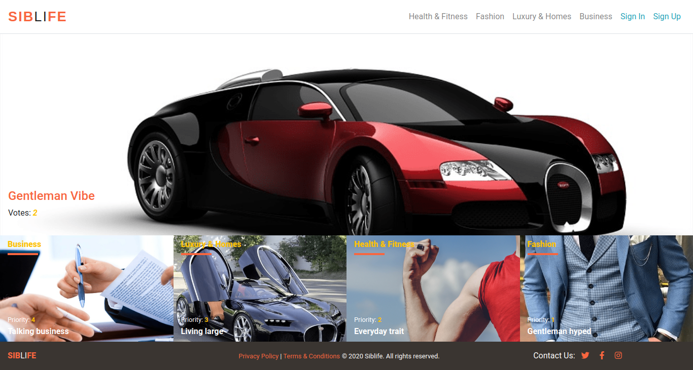

# Rails Capstone: Lifestyle Articles
> This repo holds the ruby on rails capstone project inspired by microverse.org & [creativecommons](https://www.behance.net/gallery/14554909/liFEsTlye-Mobile-version).

Capstone projects are solo projects at the end of each of the Microverse Main Technical Curriculum sections. They are meant to give the author the knowledge & real-world working experience through the business specifications which are included in the project requirements. The capstone project is a way of assessing the author's abilities to work with technologies that they acquired under a certain section of the Main Technical Curriculum ( Ruby on Rails in this case ).

This application is based on lifestyle articles website. I developed it following the [creativecommons](https://www.behance.net/gallery/14554909/liFEsTlye-Mobile-version) design. The main goal was to come up with an application that looks as the one in the design. As an optional requirement, I personalized the content to build an application ( Siblife ) which is a site where consumers can post, vote & read on articles. The app is a desktop application, it does not resize perfectly on small screens. Users can create accounts to vote & write articles or readmore about a certain article.

To sign up, users are required to use their name, which they will also use for signing in. It's not in the requirements of the project, but I had to add more fields on the signup/signin pages for better presentation & style. To view the app, visit the link below under the Live Demo section & play with it.

To set up the project on your local machine, follow the instructions below. Please give a start if you like the project.

## Built With

- Sass (.scss)
- Bootstrap
- Ruby v2.7.0
- Ruby on Rails v6.0.3
- rails-rspec
- rubocop
- stylelint
- cloudinary
- carrierwave

# Image storage:
As for images, I configured my development, test, & production environment to use [cloudinary](https://cloudinary.com/). You can follow [this tutorial](https://hackernoon.com/image-storage-in-rails-apps-using-cloudinary-and-active-storage-9w2u3yli) written by [@brana](https://hackernoon.com/u/bruna) on how you can configure your environments to use cloudinary storage for storing your images. It's free.


## Live Demo

[Siblife livedemo](https://siblife.herokuapp.com/)

## Homepage ScreenShot



## Getting Started

To get a local copy up and running follow these simple example steps.

### Prerequisites

Ruby: 2.7.0
Rails: 5.2.3
Postgres: >=9.5

### Additional gems:
- carrierwave
- cloudinary

### Setup

Install gems with:

```
bundle install
```

### Add Bootstrap dependencies by running:

```
yarn add bootsrap jquery popper.js'
```

or

```
  yarn install
```

Reconfigure database.yml file for your local environment (i.e configuring development & test databases) to use a local username & password of your choice & run:

```
  rails db:drop db:create db:migrate
```

### Usage

Start server with:

```
    rails s
```

Open `http://localhost:3000/` in your browser.

### Run tests

- for all files:
```
    bundle exec rspec
```

- for single file:

```
    bundle exec rspec spec/name_of_spec.rb
```

## Author

:bust_in_silhouette: **Clayton Siby**
- Github: [@Clayton Siby](https://github.com/ClaytonSiby)
- Twitter: [@ClaytonSiby](https://twitter.com/ClaytonSiby)
- Linkedin: [linkedin](https://www.linkedin.com/in/clayton-siby/)
- claytonsiby@gmail.com

## :handshake: Contributing

Contributions, issues and feature requests are welcome!
Feel free to check the [issues page](https://github.com/ClaytonSiby/RoR-Capstone-Lifestyle-articles/issues).

## Show your support

Give a :star:️ if you like this project!

## Acknowledgments

- Nelson Sakwa
<p> Stackoverflow </p>
<p> Odin Project </p>
<p> getbootstrap.com </p>
<p> w3schools </p>
<p> Rails Community </p>
<p> Microverse.org </p>

## :memo: License

[creativecommons](https://creativecommons.org/licenses/by-nc-nd/4.0/)

